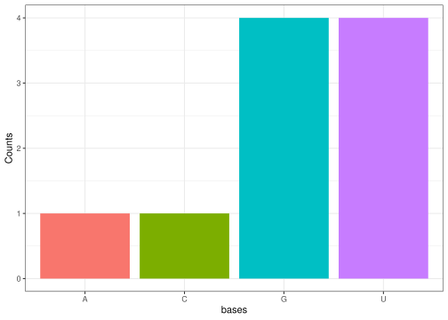

<!-- README.md is generated from README.Rmd. Please edit that file -->

# centraldog

<!-- badges: start -->
<!-- badges: end -->

The goal of centraldog is to …

## Installation

You can install the development version of centraldog from
[GitHub](https://github.com/) with:

``` r
# install.packages("pak")
pak::pak("rforbiodatascience25/Group08_package")
```

## Example

``` r
library(centraldog) # load the package
```

``` r
# create random DNA sequence 
create_DNA(n = 10) 
#> [1] "CGACACGATA"
# note that it returns object called DNA_seq
```

``` r
# turn the created DNA into RNA 
DNA_to_RNA("GGTGTTTGAC") 
#> [1] "GGUGUUUGAC"
# note that it returns object called RNA_seq
```

``` r
# find codons using default start position (1) 
find_codons("GGUGUUUGAC") 
#> [1] "GGU" "GUU" "UGA"
# find codons using frameshift +2 
find_codons("GGUGUUUGAC", 2)
#> [1] "GUG" "UUU" "GAC"
```

``` r
# traslate codons to amino acids 
translate_codons(c("GGU", "GUU", "UGA"))
#> [1] "GV_"
```

``` r
# generate base distribution plot 
base_dist_plot("GGTGTTTGAC") 
```


``` r
base_dist_plot("GGUGUUUGAC")
```


